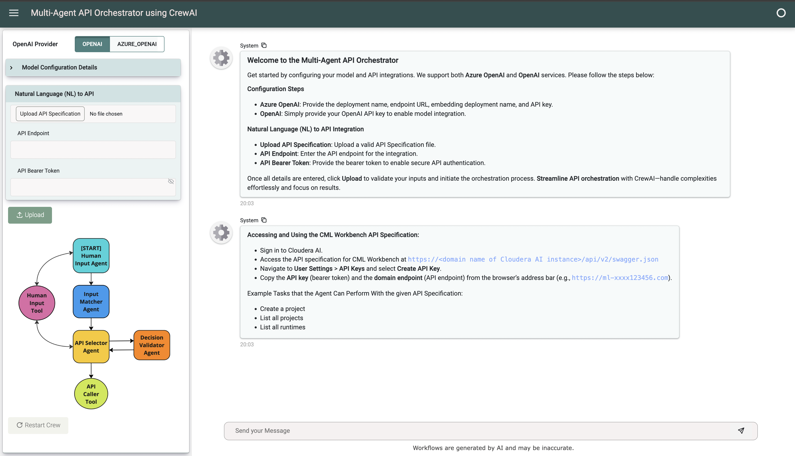
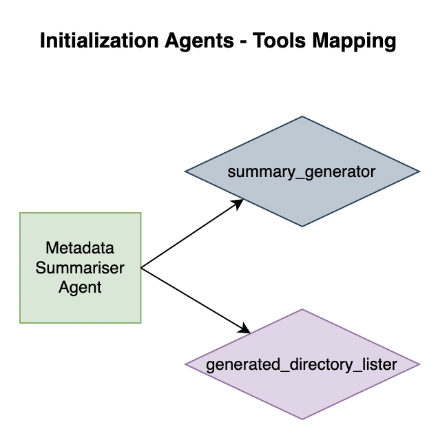
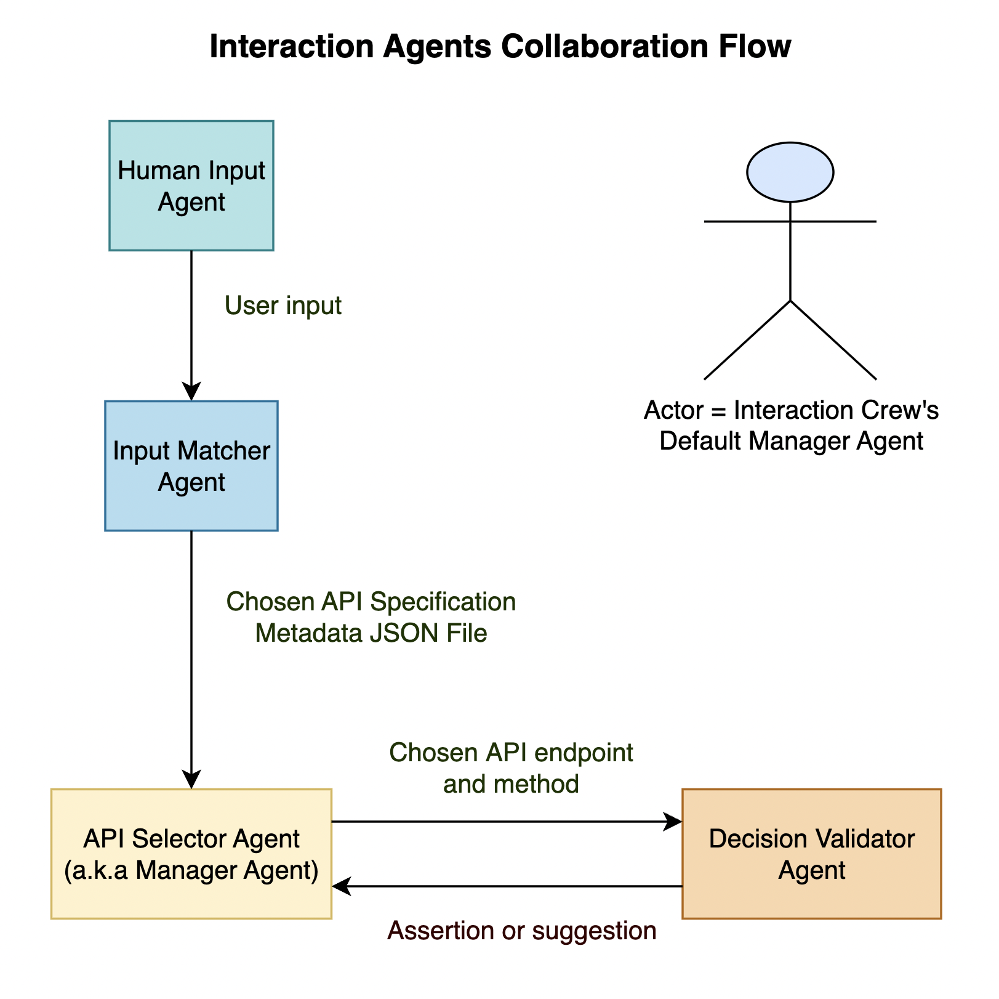
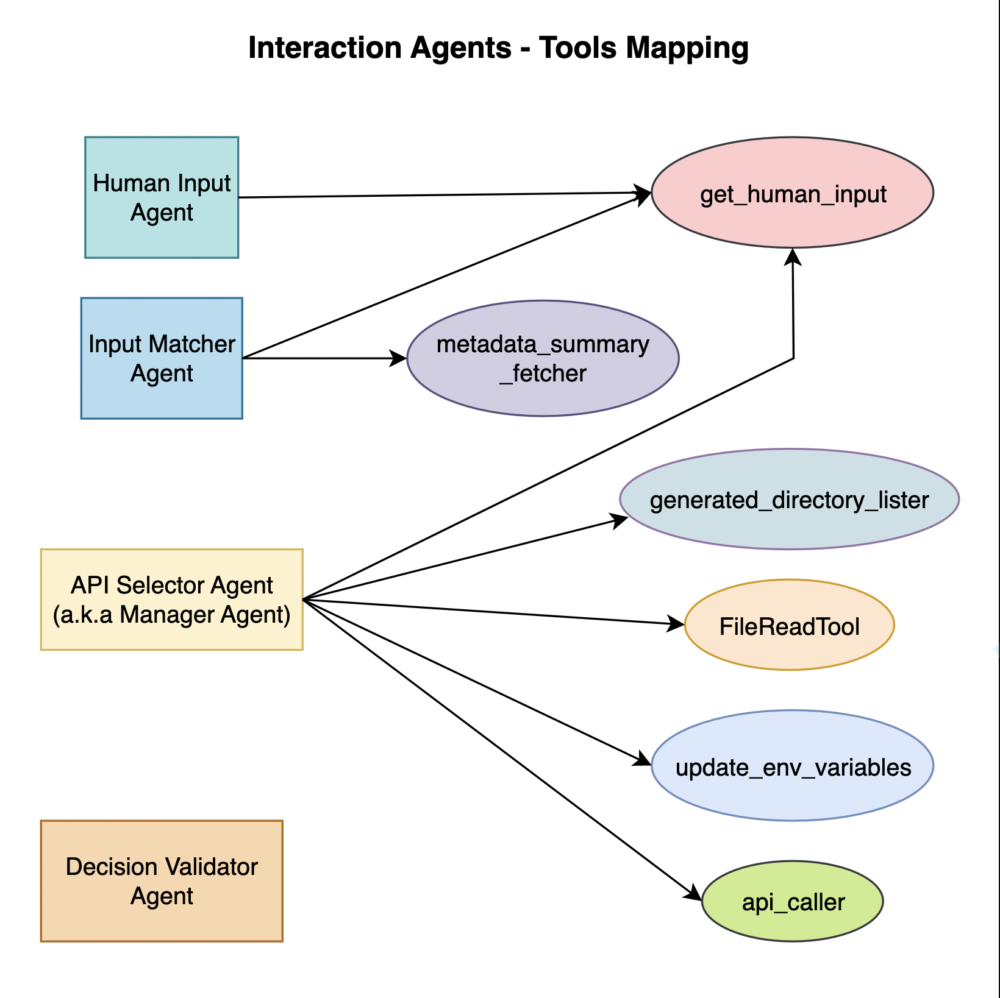

# Multi-Agent API Orchestrator using CrewAI

This repository showcases the implementation of a **Multi-Agent API Orchestrator**, an advanced application powered by CrewAI. The orchestrator leverages a multi-agent collaborative framework, where multiple intelligent agents work in tandem to streamline interactions with APIs. These agents dynamically interpret user queries, process complex API Specification files such as Swagger or OpenAPI, and efficiently execute API calls tailored to the user's input.

By harnessing natural language processing capabilities, the system allows users to interact seamlessly with their services, bypassing the need for intricate technical knowledge. This innovative approach simplifies workflows and highlights how multi-agent systems can enhance API management, enabling more effective integration and automation for modern application ecosystems.

---

## The Technology in Action: CrewAI

**CrewAI** is an advanced multi-agent framework designed to simplify and optimize complex task execution by coordinating multiple autonomous agents. It provides a platform for defining, orchestrating, and managing agents to collaborate dynamically, each focusing on specific subtasks to accomplish overarching goals efficiently.

### Key Features of CrewAI
- **Agent Coordination**:
  - Multiple agents can be deployed simultaneously, each performing distinct roles.
  - Agents can communicate and share intermediate results for cohesive task execution.
- **Integration with APIs**:
  - CrewAI integrates seamlessly with APIs and external services, making it suitable for tasks involving data fetching, analysis, or interaction with external systems.
- **Dynamic Orchestration**:
  - Tasks are split into smaller components, and CrewAI dynamically assigns agents to these subtasks.
  - Agents adapt their behavior based on context and intermediate outcomes.
- **Scalability**:
  - Designed to handle both simple and large-scale tasks, CrewAI can scale with additional agents or resources when needed.
- **Use in Multi-Agent Systems**:
  - Supports building systems where agents analyze, validate, and act upon user inputs or system states collaboratively.

### Example Use Cases
- **API Orchestration**: CrewAI handles scenarios where user input requires multiple API calls, aggregating results to provide meaningful responses.
- **Troubleshooting Automation**: In a Kubernetes environment, CrewAI agents identify and resolve issues within pods, namespaces, or clusters.
- **Dynamic Task Allocation**: Tasks such as generating reports, processing large datasets, or monitoring systems can be distributed among agents for faster execution.

### Why Choose CrewAI?
CrewAI excels in scenarios that require:
- High levels of parallelism.
- Dynamic decision-making by agents.
- Collaboration between multiple autonomous systems.

Its modular and flexible nature makes it an excellent choice for projects involving multi-agent orchestration, automation, or dynamic decision-making workflows.

---

## The UI Framework: Panel

Panel is an open-source Python library powered by HoloViz and designed to streamline the development of robust tools, dashboards, and complex applications entirely within Python. With a comprehensive philosophy, Panel integrates seamlessly with the PyData ecosystem, offering powerful, interactive data tables, visualizations, and much more, to unlock, visualize, share, and collaborate on your data for efficient workflows.

Its feature set includes high-level reactive APIs and lower-level callback-based APIs, enabling rapid development of exploratory applications and facilitating the creation of intricate, multi-page applications with extensive interactivity.

### Why Choose Panel?
Panel is a versatile Python-based library that works well for more complex, multi-threaded applications:

- **Session State Management**: Panel supports session-based state management, which is critical for applications that rely on persistent states across user interactions.
- **Multi-Threading and Performance**:
  - Integrates well with backends like FastAPI or Tornado for multi-threaded performance.
  - Supports asynchronous updates and interaction, making it suitable for handling concurrent tasks and updates from CrewAI agents.
- **Rich Interaction Models**:
  - Supports sliders, dropdowns, plots, and widgets, enabling dynamic interactions with AI agents or tasks.
- **Integration with Python Ecosystem**:
  - Seamless integration with Python visualization libraries like Bokeh, Matplotlib, and Plotly.
  - Can handle real-time updates via WebSockets.

---

## Multi-Agent API Orchestrator: Getting Started

In the application interface, you can customize the configuration to suit your specific needs. Under the **"Model Configuration Details"** section, select and configure the model you wish to use for processing your requests. In the **"Natural Language (NL) to API"** section, define the API Specifications that facilitate seamless communication between natural language inputs and their corresponding API calls. We support both **Azure OpenAI** and **OpenAI** providers, offering flexibility to leverage the capabilities of your preferred OpenAI Provider. Simply select the provider and input the required credentials.

    

### Model Configuration Steps
- **Azure OpenAI**: Provide the deployment name, endpoint URL, embedding deployment name, and Azure OpenAI API key.
- **OpenAI**: Provide your OpenAI API key to enable model integration.

### Natural Language (NL) to API Integration Details
- **Upload API Specification**: Upload a valid API Specification file.
- **API Endpoint**: Enter the API endpoint for the integration.
- **API Bearer Token**: Provide the bearer token to enable secure API authentication.

Once the Natural Language (NL) to API details are entered, click **Upload** to validate your inputs and initiate the orchestration process. **Streamline API orchestration** with CrewAI—handle complexities effortlessly and focus on results.

---

## Structure and Components: The Initialization Crew

### Tools Used
1. **summary_generator**: Passes provided text to an LLM model and returns a detailed summary.
2. **generated_directory_lister**: Recursively lists the generated directory's content.

### Agent in Action
**Metadata Summarizer Agent**: Generates concise, descriptive summaries of API capabilities for all API Specification JSON files.

    

### Tasks and Workflow
#### When the Natural Language (NL) to API Details are Uploaded:
1. Locate the uploaded API Specification file and split it into smaller, path-specific chunks for easier management.
2. **Metadata Summarizer Task [Metadata Summarizer Agent]**: Triggers the 'summary_generator' tool to generate metadata summaries for each API Specification file. If metadata summaries already exist, no action is taken.

---

## Structure and Components: The Interaction Crew

### Tools Used
1. **get_human_input**: Gathers input from the user.
2. **update_env_variables**: Updates environment variables (API Endpoint/Bearer Token) on the fly.
3. **metadata_summary_fetcher**: Reads content from generated metadata summaries.
4. **api_caller**: Makes API calls using the "requests" Python library.
5. **generated_directory_lister**: Recursively lists the generated directory's content.
6. **FileReadTool**: Reads file content (CrewAI native tool).

### Agents in Action
1. **Human Input Agent**: Gathers required information from the user and relays it back to the delegating agent.
2. **Input Matcher Agent**: Identifies the best matching Swagger metadata file for a given task using metadata summaries.
3. **API Selector Agent**: Selects the most appropriate API endpoint and method from metadata files, clarifies required parameters, executes the call, and handles any errors.
4. **Decision Validator Agent**: Validates whether the actions of the API Selector Agent fulfill the original query and provides feedback with reasoning.

    
    

### Tasks and Workflow
#### When Crew Execution is Initiated:
1. **Initial Human Input Task [Human Input Agent]**: Prompts the user for their desired action based on the API Specification file and returns their response without alterations.
2. **Input Matching Task [Input Matcher Agent]**: If multiple API Specification files are uploaded, identifies and returns the optimal file based on user task context and metadata summary analysis.
3. **Manager Task [API Selector Agent]**: Identifies the most suitable API endpoint and method based on metadata and user context, ensuring all parameters are accounted for and the payload is confirmed.
4. **Decision Validator Task [Decision Validator Agent]**: Validates the API Selector Agent's proposed actions against the original query to ensure alignment with user intent.
5. Finish execution and prepare for the next user action in a continuous chat format.

---

## Application Features

### Restart Crew
Enables users to restart the crew on demand, useful for scenarios such as retrying due to unfavorable circumstances or starting afresh after undesired input.

### Multiple and Parallel API Specification File Processing
Allows users to upload multiple API specification files on the fly without interrupting ongoing workflows in the chat interface. The details of file processing are displayed dynamically in the sidebar.

### Choice of OpenAI Provider
Supports both Azure OpenAI and OpenAI, which can be chosen either at the beginning of the execution or even before uploading a different API Specification file. Users can toggle between providers and upload corresponding details for the desired level of accuracy and performance.

### Clear Indication of Agent and Tool in Action
The diagrams in the sidebar visually indicates the workflow in progress, enabling users to monitor the agents and tools being executed and gain insights into the processing steps.
